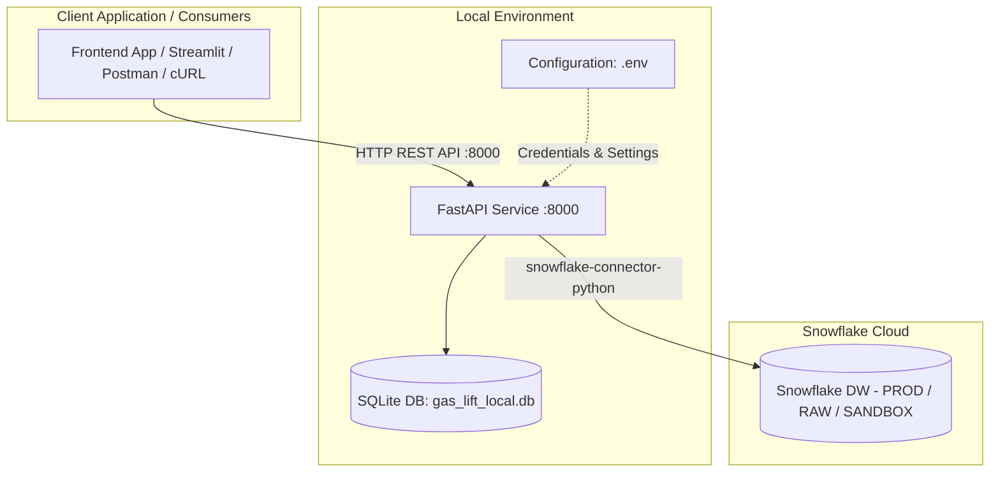

# 🛢️ Gas Lift Allocation Optimizer - Standalone Backend API

Production-grade gas lift injection allocation and optimization backend service for oil fields and wells. This repository provides a high-performance **FastAPI** REST API, advanced curve fitting regressors, mathematical linear and non-linear optimization pipelines powered by **PuLP** and **SciPy**, relational persistence with **SQLModel / SQLite**, and seamless **Snowflake** integration for production metrics.

---

### 📑 Table of Contents
1. [General Architecture](#-general-architecture)
2. [Backend Directory Structure](#-backend-directory-structure)
3. [Environment Configuration & Variables](#-environment-configuration--variables)
4. [API & Controller Documentation](#-api--controller-documentation)
   - [Root / Health](#1-root--health)
   - [Data Controller (`/api/data`)](#2-data-controller-apidata)
   - [Well Controller (`/api/wells`)](#3-well-controller-apiwells)
   - [Optimization Controller (`/api/optimization`)](#4-optimization-controller-apioptimization)
5. [Local Development Setup & Execution](#-local-development-setup--execution)
6. [Testing & Quality Assurance](#-testing--quality-assurance)
7. [Troubleshooting & FAQ](#-troubleshooting--faq)

---

## 🏛 General Architecture



The backend operates as an autonomous REST API service:
- **Mathematical Computation & Optimization Pipeline:** Performance curve fitting (Namdar non-linear regressor with confidence intervals) and mathematical programming constrained by total field gas lift availability or global optimal envelope exploration.
- **Relational Persistence (`gas_lift_local.db`):** Uses SQLModel / SQLite locally to store historical field optimization runs and detailed allocations per well.
- **Snowflake Database Integration & Fallback:** Connects directly to Snowflake via credentials configured in `.env` to read corporate wellbore metadata and historical production test metrics (`BSW`, `Q_OIL`, `Q_GAS`, `WHP`). If Snowflake is offline or unreachable, it seamlessly switches to a resilient fallback with realistic mock data.

---

## 📂 Backend Directory Structure

```
backend/
├── requirements.txt            # Python backend dependencies
├── main.py                     # FastAPI application instance, CORS, router inclusion
├── database.py                 # Direct Snowflake connection + SQLModel engine
├── controllers/                # HTTP endpoint controllers
│   ├── data_controller.py      # CSV file upload and parsing
│   ├── well_controller.py      # Active wells and production tests retrieval
│   └── optimization_controller.py # Constrained/global optimization pipelines & history
├── entities/                   # Data models and SQLModel database tables
│   ├── well.py
│   ├── production_test.py
│   ├── field_optimization.py   # Table: 'field_optimizations'
│   └── well_optimization.py    # Table: 'well_optimizations'
├── repositories/               # Data access layer (Snowflake queries & ORM)
│   ├── well_repository.py
│   ├── production_test_repository.py
│   ├── field_optimization_repository.py
│   └── well_optimization_repository.py
├── services/                   # Business logic and mathematical computations
│   ├── data_loader_service.py
│   ├── fitting_service.py      # Curve fitting (oil production vs gas injection)
│   ├── regression_service.py
│   ├── optimization_model_service.py
│   ├── optimization_constrained_pipeline_service.py
│   ├── optimization_global_pipeline_service.py
│   ├── optimization_service.py
│   └── well_service.py
└── tests/                      # Unit and integration tests
```

---

## ⚙️ Environment Configuration & Variables

Create a `.env` file in the project root for local development:

```ini
# --- Snowflake Local Credentials ---
SNOWFLAKE_ACCOUNT=zneenng-hz50319
SNOWFLAKE_USER=your_username
SNOWFLAKE_PASSWORD=your_password
SNOWFLAKE_ROLE=ACCOUNTADMIN
SNOWFLAKE_WAREHOUSE=COMPUTE_WH

# --- Default / Sandbox DB ---
SNOWFLAKE_DATABASE=SANDBOX
SNOWFLAKE_SCHEMA=GLTB

# --- Production DB (Production tests) ---
PROD_SNOWFLAKE_DATABASE=PROD
PROD_SNOWFLAKE_SCHEMA=ANALYTICS_D_PRODUCTION
PROD_SNOWFLAKE_ROLE=ACCOUNTADMIN

# --- Raw DB (Wellbore references) ---
RAW_SNOWFLAKE_DATABASE=RAW
RAW_SNOWFLAKE_SCHEMA=AGG__OPERATIONREFERENCE_V02
RAW_SNOWFLAKE_ROLE=ACCOUNTADMIN
```

> [!NOTE]
> If Snowflake credentials are not configured or the remote service is unavailable, the application gracefully activates fallback mock data so you can continue testing and developing locally without interruption.

---

## 📡 API & Controller Documentation

FastAPI provides automated interactive API documentation at:
- **Swagger UI:** `http://localhost:8000/docs`
- **ReDoc:** `http://localhost:8000/redoc`
- **OpenAPI Schema:** `http://localhost:8000/openapi.json`

Detailed breakdown of controllers and endpoints:

### 1. Root / Health

#### `GET /`
Verifies backend service operational status.
- **Response `200 OK`:**
  ```json
  {
    "status": "online",
    "service": "Gas Lift Allocation Optimizer API"
  }
  ```

---

### 2. Data Controller (`/api/data`)

Handles server-side parsing of production data CSV files.

#### `POST /api/data/load`
Receives a CSV file containing injection and fluid rate records per well, parses columns, and returns structured arrays.
- **Content-Type:** `multipart/form-data`
- **Body:** `file` (`.csv` file)
- **Response `200 OK`:**
  ```json
  {
    "q_gl_list": [[0.0, 500.0, 1000.0], [0.0, 400.0, 800.0]],
    "q_fluid_list": [[100.0, 800.0, 1200.0], [50.0, 600.0, 950.0]],
    "wct_list": [15.5, 20.0],
    "list_info": ["Well A", "Well B"]
  }
  ```

---

### 3. Well Controller (`/api/wells`)

Interacts with Snowflake production and reference tables.

#### `GET /api/wells`
Retrieves a list of active wellbore names.
- **Fallback:** If Snowflake is offline or unreachable, returns default wellbores.
- **Response `200 OK`:**
  ```json
  [
    "Well 1",
    "Well 2",
    "Well 3",
    "Well 4",
    "Well 5"
  ]
  ```

#### `POST /api/wells/tests/latest`
Fetches the latest production tests for a specified list of wellbores.
- **Request Body (JSON):**
  ```json
  {
    "well_names": ["WELL-01", "WELL-02"]
  }
  ```
- **Response `200 OK`:**
  ```json
  [
    {
      "id": null,
      "wellbore_ci_id": "MOCK",
      "wellbore_ci_name": "WELL-01",
      "subsidiary_id": 1,
      "subsidiary_name": "Subsidiary A",
      "test_date": "2026-09-06 08:00:00",
      "location_id": 1,
      "location_name": "Field North",
      "bsw": 15.0,
      "q_gl": 450.0,
      "q_oil": 1100.0,
      "q_gas": 1400.0,
      "q_water": 250.0,
      "q_liquid": 1350.0,
      "whp": 220.0
    }
  ]
  ```

---

### 4. Optimization Controller (`/api/optimization`)

Mathematical optimization engine. Performs curve fitting, linear programming allocation with PuLP, and relational persistence.

#### `POST /api/optimization/constrained`
Executes optimization under an available field gas limit and automatically persists the run and well allocations to the database.
- **Request Body (JSON):**
  ```json
  {
    "q_gl_list": [[0.0, 500.0, 1000.0, 1500.0], [0.0, 400.0, 800.0, 1200.0]],
    "q_fluid_list": [[0.0, 600.0, 1100.0, 1300.0], [0.0, 500.0, 950.0, 1150.0]],
    "wct_list": [12.0, 18.5],
    "list_info": ["Well A", "Well B"],
    "qgl_limit": 2000.0,
    "qgl_min": 50.0,
    "p_qoil": 75.0,
    "p_qgl": 2.5
  }
  ```
- **Internal Pipeline:**
  1. `FittingService`: Fits performance curves (oil production rate vs gas injection rate).
  2. `OptimizationConstrainedPipelineService`: Solves the mathematical allocation problem (Maximize total oil production subject to $\sum Q_{gl} \le Q_{gl}^{limit}$).
  3. Automatically persists the run to `field_optimizations` and individual well allocations to `well_optimizations`.
- **Response `200 OK`:**
  ```json
  {
    "optimization_results": {
      "total_oil_production": 2150.45,
      "total_gas_injection": 1980.00,
      "allocated_rates": [1050.00, 930.00],
      "oil_rates": [1180.20, 970.25],
      "status": "Optimal"
    },
    "well_results": [
      {
        "optimization_id": 14,
        "well_number": 0,
        "well_name": "Well A",
        "optimal_production": 1180.20,
        "optimal_gas_injection": 1050.00
      },
      {
        "optimization_id": 14,
        "well_number": 1,
        "well_name": "Well B",
        "optimal_production": 970.25,
        "optimal_gas_injection": 930.00
      }
    ]
  }
  ```

#### `POST /api/optimization/global`
Executes an iterative global simulation across a wide range of gas lift injection capacities to identify field maximum potential and economic inflection points (not persisted to DB).
- **Request Body (JSON):**
  ```json
  {
    "q_gl_list": [[0.0, 500.0, 1000.0], [0.0, 400.0, 800.0]],
    "q_fluid_list": [[0.0, 600.0, 1100.0], [0.0, 500.0, 950.0]],
    "wct_list": [10.0, 15.0],
    "list_info": ["Well 1", "Well 2"],
    "qgl_min": 0.0,
    "p_qoil": 70.0,
    "p_qgl": 3.0,
    "max_iterations": 40,
    "max_qgl": 50000
  }
  ```
- **Response `200 OK`:** Returns stepped injection arrays, incremental oil production, and economic optimum thresholds.

#### `GET /api/optimization/history`
Retrieves historical field optimization runs.
- **Query Parameters:** `limit` (int, default: 10)
- **Response `200 OK`:**
  ```json
  [
    {
      "id": 14,
      "execution_date": "2026-09-06T08:30:00",
      "total_production": 2150.45,
      "total_gas_injection": 1980.00,
      "gas_injection_limit": 2000.00,
      "oil_price": 75.0,
      "gas_price": 2.5,
      "field_name": "Main Field"
    }
  ]
  ```

#### `GET /api/optimization/history/{opt_id}`
Returns details of a specific field optimization run by its primary key ID.

#### `GET /api/optimization/history/{opt_id}/wells`
Returns individual well allocations associated with optimization run `opt_id`.

---

## 💻 Local Development Setup & Execution

### 1. Prerequisites
- Python 3.10 or 3.11
- Conda (Miniconda / Anaconda) or `pip` / `venv`

### 2. Environment Setup

#### Option A: Using Conda (Recommended)
If you already have the `gltb` environment:
```bash
conda activate gltb
```

Or create it from `environment.yml`:
```bash
conda env create -f environment.yml
conda activate gltb
```

#### Option B: Using Python `venv`
```bash
# Create and activate virtual environment
python -m venv venv

# On Linux/macOS:
source venv/bin/activate

# On Windows (PowerShell):
.\venv\Scripts\Activate.ps1

# Install dependencies
pip install -r backend/requirements.txt
```

### 3. Start the FastAPI Server
Run from the root directory of the repository:

```bash
uvicorn backend.main:app --host 127.0.0.1 --port 8000 --reload
```

Or using Python module syntax:
```bash
python -m uvicorn backend.main:app --host 127.0.0.1 --port 8000 --reload
```

The server will listen at `http://localhost:8000`. Upon initial startup, it automatically creates the local SQLite database file `gas_lift_local.db` in the repository root if it does not exist.

---

## 🧪 Testing & Quality Assurance

Run the automated test suite with `pytest`:

```bash
# With active environment
pytest backend/tests

# Or directly with Conda:
conda run -n gltb pytest backend/tests
```

The test suite covers:
- API endpoints and JSON serialization (`test_api.py`)
- Performance curve fitting and confidence intervals (`test_fitting.py`)
- Regression model calculations and bounds (`test_regression.py`)

---

## 🔍 Troubleshooting & FAQ

| Symptom / Error | Possible Cause | Solution |
|---|---|---|
| `No Snowflake session or environment variables detected` | Missing or incomplete `.env` file. | Verify that `.env` exists in the repository root with the required `SNOWFLAKE_*` variables. The application will use mock fallback data in the meantime. |
| `Address already in use [Errno 48 / 10048]` | Port 8000 is occupied by another process. | Run on a different port: `uvicorn backend.main:app --port 8080 --reload`. |
| `ModuleNotFoundError` | Virtual/Conda environment not activated. | Activate your environment (`conda activate gltb` or `venv\Scripts\activate`) before running commands. |
| SQLite database locked or corrupted | Concurrent locks or unfinished transactions. | Stop the local server and delete `gas_lift_local.db` to let the application recreate a fresh SQLite database upon restart. |
